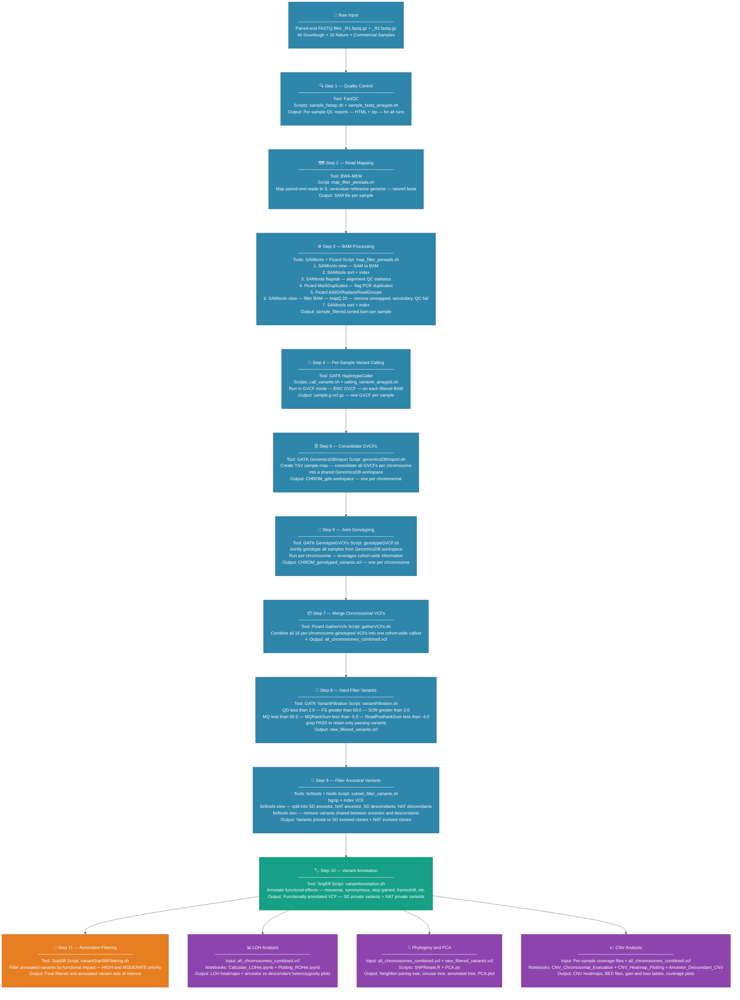

# Experimental Evolution of Sourdough Yeast: Genomic Variant Analysis

## Acknowledgements

I would like to thank Professor Caiti Heil and the Heil Lab at North Carolina State University
for allowing me to be part of this amazing project, as well as providing consent to post my work here. 
This was my first introduction into bioinformatics and I am extremely grateful for all of the tools and 
skills that I have gained during my time working here.

I am listed as a co-author in **Demystifying Domestication of Sourdough Yeast: Evolution, Diversity and Metabolism**,
which was submitted to **The International Conference on Yeast Genetics and Molecular Biology**.


## Overview

This project investigates genetic variants in *Saccharomyces cerevisiae* that confer 
fitness advantages in the bread dough environment through an **experimental evolution 
framework**. Using whole-genome sequencing data from sourdough and nature-isolated yeast 
populations, this project identifies and characterizes three major classes of genomic 
variation:

- **Single Nucleotide Variants (SNVs)**
- **Copy Number Variants (CNVs)**
- **Loss of Heterozygosity (LOH) Events**

Variants were identified relative to ancestral strains in both experimental populations, 
allowing us to distinguish evolved, potentially adaptive mutations from standing genetic 
variation.

---

## Biological Context

Yeast strains used in sourdough baking experience strong, consistent selective pressures — 
high sugar concentrations, acidity, and temperature fluctuation. By evolving yeast populations in this environment 
and comparing their genomes to ancestral strains and nature-isolated counterparts, we can identify mutations that 
arose specifically in response to the sourdough niche.

| Population | Samples | Ancestor |
| --- | --- | --- |
| Sourdough (SD) | 46 evolved clones | 892B |
| Nature (NAT) | 26 evolved clones | ERR1308867 |

---

## Repository Structure
```
├── scripts/
│   |── sample_fastqc.sh
│   ├── sample_fastq_arrayjob.sh
│   ├── map_filter_pereads.sh
│   ├── call_variants.sh
│   ├── calling_variants_arrayjob.sh
│   ├── genomicsDBImport.sh
│   ├── genotypeGVCF.sh
│   ├── gatherVCFs.sh
│   ├── subset_filter_variants.sh
│   ├── variantFiltration.sh
│   ├── variantAnnotation.sh
│   └── variantSnpSiftFiltering.sh
│
├── LOHet/
│   ├── all_chromosomes_combined.vcf
│   ├── Calculate_LOHet.ipynb
│   ├── Plotting_ROHet.ipynb
│   └── Output/
│      ├── heterozygosity_892B_vs_sourdough_samples/
│      ├── heterozygosity_ERR1308867_vs_nature_samples/
│      ├── ROHet_final_heatmap.png
│      ├── ROHet_NAT.png
│      └── ROHet_SD.png
│
|── Phylogeny/
│   ├── zll_chromosomes_combined.vcf
│   ├── all_chromosomes_combined.gds
│   ├── new_filtered_variants.vcf
│   ├── nat_samples.txt
│   ├── sd_samples.txt
│   ├── sample_ancestors.csv
│   ├── PCA.py
│   ├── SNPrelate.R
│   └── Plots + Output/
│      ├── Phylogenetic_Neighbor_Tree.png
│      ├── Circular_Phylogenetic_Tree.png
│      ├── Annotated_Phylogenetic_Tree.png
│      ├── annotated_tree_legend.png
│      └── PCA_plot.png
│
|── CNV/
|   ├── newref.fasta
|   ├── newref.fai
|   ├── sd_samples.txt
|   ├── nat_samples.txt
|   ├── all_chromosomes_combined.vcf
|   ├── CNV_Chromosomal_Evaluation.ipynb
|   ├── CNV_Heatmap_Plotting.ipynb
|   ├── Ancestor_Descendant_CNV_Comparison.ipynb
|   ├── CNV_Gain_Loss/
|      ├── Coverage_nature_sourdough_aligned.png
|      ├── whole_genome_coverage_892B_vs_clones.pdf
|      ├── whole_genome_coverage_ERR1308867_vs_clones.pdf
|      ├── Coverage Files/
│         └── [sample]_coverage.txt / _coverage_values.txt
|      |── Output/
|         ├── [sample].BED files
|         ├── combined_nat_gain.xlsx
|         ├── combined_nat_loss.xlsx
|         ├── combined_sd_gain.xlsx
|         └── combined_sd_loss.xlsx
```

---

## Pipeline Overview

Raw paired-end FASTQ files were processed through a multi-step bioinformatics pipeline 
to produce a final, annotated variant callset. The following flowchart describes the full bioinformatics pipeline used to process 
raw sequencing reads into a filtered, annotated variant callset.



### Tools Used

| Step | Tool |
|---|---|
| Quality Control | FastQC |
| Read Mapping | BWA-MEM |
| SAM/BAM Processing | SAMtools, Picard |
| Variant Calling | GATK HaplotypeCaller |
| Joint Genotyping | GATK GenomicsDBImport, GenotypeGVCFs |
| VCF Merging | Picard GatherVcfs |
| Variant Filtering | GATK VariantFiltration, bcftools |
| Variant Annotation | SnpEff |
| Variant Subsetting | SnpSift, bcftools isec |
| CNV Analysis | Custom Python (Jupyter Notebooks) |
| LOH Analysis | Custom Python (Jupyter Notebooks) |
| Phylogenetics | SNPRelate (R), Custom Python PCA |

---

---

## Analysis Modules

### 🔬 Variant Calling Pipeline (`scripts/`)

Shell scripts implementing the full GATK best-practices pipeline from raw FASTQ files 
to a filtered, annotated multi-sample VCF (`all_chromosomes_combined.vcf`).

**Key steps:**
1. FastQC quality assessment of raw reads
2. BWA-MEM mapping to *S. cerevisiae* reference genome
3. SAMtools/Picard BAM processing and duplicate marking
4. GATK HaplotypeCaller in GVCF mode (per-sample)
5. GenomicsDBImport consolidation (per-chromosome)
6. Joint genotyping with GenotypeGVCFs
7. Picard GatherVcfs merging into `all_chromosomes_combined.vcf`
8. GATK VariantFiltration (hard filtering, GATK best practices)
9. bcftools filtering to remove ancestral variants
10. SnpEff annotation and SnpSift filtering

---

---

### Loss of Heterozygosity (`LOHet/`)

**`Calculate_LOHet.ipynb`**
Detects LOH events genome-wide using variant call data from `all_chromosomes_combined.vcf`. 
The pipeline:
- Identifies heterozygous sites in the ancestral strain
- Tracks those sites in evolved clones
- Flags regions with 3+ consecutive homozygous sites (windowed in 500 bp bins)
- Characterizes LOH events by size, location, and gene content

**`Plotting_ROHet.ipynb`**
Generates chromosome-wide heterozygosity profiles for all samples and comparative 
visualizations between SD and NAT populations.

**Key Outputs:**
- Per-sample ancestor vs. descendant heterozygosity plots (SD and NAT)
- Full genome-wide LOH heatmap across all 16 chromosomes (10,000 bp windows, chrM excluded)
- Separate SD and NAT heatmaps

---

### Phylogenetics & PCA (`Phylogeny/`)

**`SNPrelate.R`**
- Converts `all_chromosomes_combined.vcf` to GDS format
- Computes an Identity-By-State (IBS) distance matrix
- Builds a neighbor-joining phylogenetic tree

**`PCA.py`**
- Reads `new_filtered_variants.vcf`
- Converts genotypes to alternate allele counts
- Imputes missing values and assigns sample groups (SD, NAT, commercial)
- Generates PCA plot separating populations

**Key Outputs:**
- Neighbor-joining phylogenetic tree (full layout and circular)
- Annotated phylogenetic tree with color-coded sample groups
- PCA plot of SD, NAT, and commercial samples

---

### Copy Number Variation (`CNV/`)

**`CNV_Chromosomal_Evaluation.ipynb`**
Analyzes chromosome-level CNV to detect whole-chromosome duplications or deletions 
using normalized read depth.

**`CNV_Heatmap_Plotting.ipynb`**
Visualizes genome-wide CNV patterns across all samples as heatmaps.

**`Ancestor_Descendant_CNV_Comparison.ipynb`**
Directly compares CNV profiles between ancestral and evolved strains to identify 
patterns of genomic gain and loss over the course of experimental evolution.

**Key Outputs:**
- CNV gain/loss BED files per sample
- Compiled gain/loss tables for SD and NAT populations (`.xlsx`)
- Genome-wide coverage comparison plots
- CNV heatmaps

---
